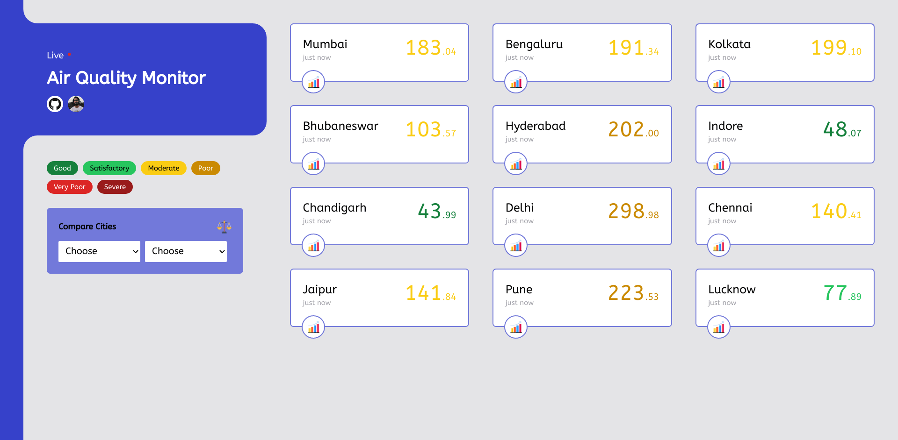
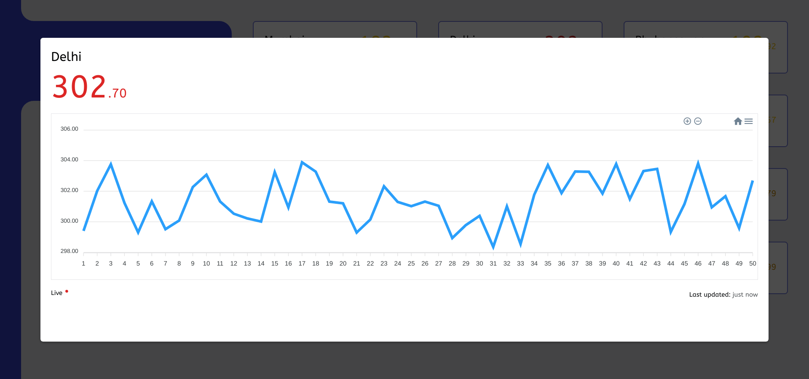
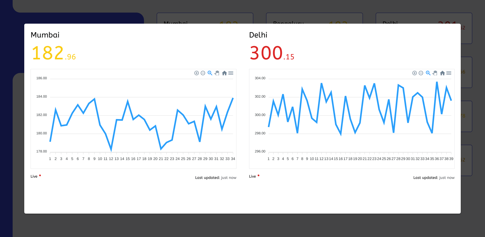

# Air Quality Monitor
A [Next.js](https://nextjs.org/) project bootstrapped with [`create-next-app`](https://github.com/vercel/next.js/tree/canary/packages/create-next-app).  

AQM is a single-page [web application](https://air-quality-monitor-pt.herokuapp.com/) to display live air quality monitoring data of a few cities in India.

## Motivation
I built this project as an assignment for a job interview. Did I get it? Yes, I got the interview ;)
 
## Samples
Click [here](./samples/wireframes/draft_a.png) to see the initial [`wireframe`](./samples/wireframes/draft_a.png).  

The below images are linked to full size images :)

<a href="./samples/home.png">
  
</a>

<a href="./samples/modal.png">
  
</a>

<a href="./samples/compare.png">
  
</a>

## Technologies Used
**Built with**
- ReactJS + NextJs

**Dependencies**
|Library|Description|
|-|-|
|[react-apexcharts](https://apexcharts.com/docs/react-charts/)|Generate and show AQI history as line graph|
|[clsx](https://github.com/lukeed/clsx#readme)|Easy naming classes|
|[react-awesome-modal](https://github.com/shibe97/react-awesome-modal)|Show single city in a pop-up modal|
|[react-time-ago](https://gitlab.com/catamphetamine/react-time-ago#readme)|Show time as text like *few seconds ago*|
|[sass](https://github.com/sass/node-sass)|Easy writing css classes|
|websocket|Connect and listen to *city-ws* web socket|
  
  
**DevDependencies**
|Library|Description|
|-|-|
|[tailwind](https://tailwindcss.com/)|CSS utils library for quick designing|


## Features
- Real-time Updates
- Simple UI
- Fully responsive
- Neat Graphs
- Color based status
- Download Graphs as PNG, SVG or CSV

## Installation
First, run the development server:

```bash
npm run dev
# or
yarn dev
```

Open [http://localhost:3000](http://localhost:3000) with your browser to see the result.

## Time Record

**`Total time: 9 h 49 m 30 s`**

A detailed list of how much time I spent on which task **from most to least**.

|Task|Time|
|-|-|
|Developing Frontend|3h 45 m 06 s|
|Creating History Chart|52 m 13 s|
|README|56 m 17 s|
|Draw Wire frames|35 m 22 s|
|Integrating Websocket|31 m 59 s|
|Deploy *Hello World* Program|17 m 49 s|
|Deploy Final App|13m 03 s|
|Initiate App + Repo|11 m 08 s|
|Installing SASS + Tailwind|9 m 16 s|
|Code Review|08 m 52 s|

|Algorithms|Time|
|-|-|
|Merging New & Current List|49 m 34 s|
|Showing Live City in Modal|25 m 28 s|
|Updating *Updated* Time|22m 56 s|
|Storing AQI History|11 m 26 s|
|Select cities for comparison|10 m 06 s|
|Converting AQI Data|05 m 28 s|
|Limit History Items|03 m 27 s|

## Credits
- wss://city-ws.herokuapp.com - Websocket for Test [here](https://www.websocket.org/echo.html)
- [Boosted](https://play.google.com/store/apps/details?id=com.boostedproductivity.app) - Helped me track my working time
- [NotiBu](https://play.google.com/store/apps/details?id=com.isolpro.notibu) - Helped me add important notes in my notification panel